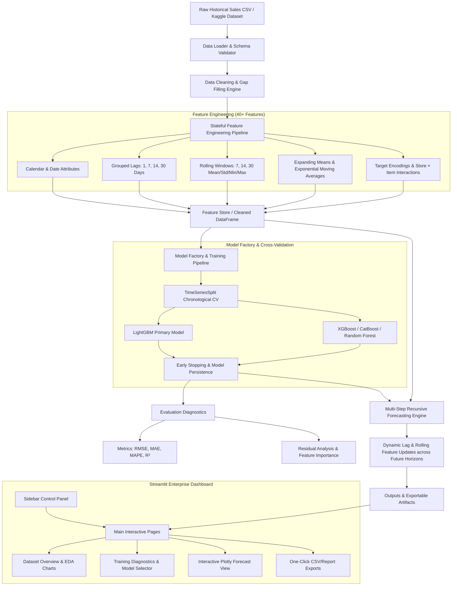

# 🚀 SmartForecast — AI-Powered Enterprise Demand Forecasting System

[](https://www.python.org/downloads/)
[](https://streamlit.io)
[](https://lightgbm.readthedocs.io/)
[](https://xgboost.readthedocs.io/)
[](https://catboost.ai/)
[](LICENSE)

**SmartForecast** is a production-grade, AI-powered multi-series demand forecasting web application designed for enterprise retail supply chain and inventory optimization. It predicts future daily sales across hundreds or thousands of **Store × Item** hierarchies using historical sales data.

---

## 📖 Table of Contents
1. [Project Overview](#-project-overview)
2. [The Business Problem](#-the-business-problem)
3. [Architecture Diagram](#-architecture-diagram)
4. [Key Features](#-key-features)
5. [Dataset Description](#-dataset-description)
6. [Installation & Quick Start](#-installation--quick-start)
7. [Project Folder Structure](#-project-folder-structure)
8. [Feature Engineering Pipeline](#-feature-engineering-pipeline)
9. [Model Training & Cross-Validation](#-model-training--cross-validation)
10. [Evaluation & Results](#-evaluation--results)
11. [Screenshots & Dashboard Walkthrough](#-screenshots--dashboard-walkthrough)
12. [Future Improvements](#-future-improvements)

---

## 🌟 Project Overview

Accurate demand forecasting is the cornerstone of modern retail inventory management. Stockouts result in lost revenue and customer churn, while overstocking leads to excessive storage costs and product write-offs.

**SmartForecast** bridges the gap between complex time-series econometric models and modern machine learning tree-boosting algorithms (`LightGBM`, `XGBoost`, `CatBoost`). By automatically transforming raw transaction logs into over **40 specialized time-series lag, window, and interaction features**, SmartForecast delivers state-of-the-art prediction accuracy with zero data leakage.

---

## 💼 The Business Problem

Retail organizations typically operate multi-level store hierarchies selling hundreds of unique items. Traditional forecasting approaches face three massive bottlenecks:
1. **Scalability across time series**: Running separate univariate ARIMA/Prophet models for 50 stores × 50 items (2,500 distinct time series) is computationally infeasible and ignores cross-item/store dynamics.
2. **Feature Leakage & Target Shift**: Incorrect lag calculation or rolling window smoothing across multi-series boundaries causes target leakage, yielding overly optimistic validation scores that fail in production.
3. **Lack of Explainability for Stakeholders**: Supply chain managers require clear transparency regarding *why* demand is spiking on certain dates (e.g., weekend effects, yearly seasonality, promotional lag spikes).

**SmartForecast solves these bottlenecks by unifying all Store × Item combinations into a global, stateful machine learning pipeline with interactive explainability.**

---

## 🏗️ Architecture Diagram



---

## ✨ Key Features

- **Out-of-the-Box Demo Mode**: Includes a built-in, highly realistic **Synthetic Kaggle Demand Generator** (incorporating yearly sine/cosine trends, weekend demand spikes, and random Gaussian noise) so any beginner can run and evaluate the system immediately without uploading external files.
- **Automated Exploratory Data Analysis (EDA)**: Interactive Plotly visualizations for daily trends, monthly/yearly seasonality, store/item volume rankings, day-of-week heatmaps, and numerical correlation matrices.
- **Zero-Leakage Stateful Feature Engineering**: Custom `FeatureEngineer` transformer that computes lags and shifted rolling windows strictly inside individual `(store, item)` groups, and stores target encoding mapping statistics for clean test/future inference.
- **Factory Pattern Model Support**: Modular support for **LightGBM**, **XGBoost**, **CatBoost**, and **Random Forest** algorithms.
- **TimeSeriesSplit Cross-Validation**: Chronological multi-fold validation with automatic early stopping to prevent overfitting on noisy historical spikes.
- **Multi-Step Recursive Future Horizon Forecasting**: Iteratively predicts `N` days into the future (`7`, `14`, `30`, `90` days), updating `Lag 1` and `Rolling Mean` inputs dynamically after every forecasted day.
- **One-Click Artifact Export**: Download predictions (`predictions.csv` for Kaggle submission), future forecast tables (`future_forecast.csv`), and comprehensive textual evaluation reports (`evaluation_report.txt`).

---

## 📂 Dataset Description

SmartForecast natively supports the schema from the **Kaggle Store Item Demand Forecasting Challenge**:

| Column Name | Type | Description |
| :--- | :--- | :--- |
| `date` | `datetime` | Date of historical sales (`YYYY-MM-DD`). |
| `store` | `int` / `str` | Unique identifier for each store location. |
| `item` | `int` / `str` | Unique identifier for each product/item. |
| `sales` | `int` | Daily units sold across the given store and item (Target). |

*Note: For test set predictions (`test.csv`), an optional `id` column is preserved and exported directly to match Kaggle submission specifications.*

---

## 🛠️ Installation & Quick Start

### Prerequisites
- Python 3.12 or higher installed on your system.

### Step 1: Clone the Repository
```bash
git clone https://github.com/YourUsername/SmartForecast.git
cd SmartForecast
```

### Step 2: Install Dependencies
Create a virtual environment (optional but recommended) and install required libraries:
```bash
python -m pip install -r requirements.txt
```

### Step 3: Launch the Streamlit Dashboard
```bash
python -m streamlit run app.py
```
*Tip: If `streamlit` is in your system PATH, you can also run `streamlit run app.py` or double-click `run_app.bat`.*
The application will automatically start and open in your browser at `http://localhost:8501`.

---

## 📁 Project Folder Structure

```text
SmartForecast/
│
├── app.py                      # Main entrypoint for Streamlit dashboard
├── config.py                   # Centralized configuration, constants & hyperparameters
├── requirements.txt            # Locked Python dependencies
├── README.md                   # Professional documentation & usage guide
├── .gitignore                  # Git exclusion rules
│
├── assets/                     # UI images, logos, or generated summary graphics
├── data/                       # Directory for train.csv, test.csv, sample dataset
├── saved_models/               # Persisted joblib model artifacts & scalers
└── outputs/                    # Exported predictions.csv, evaluation reports, graphs
│
├── preprocessing/
│   ├── __init__.py
│   ├── data_loader.py          # CSV loading, validation & synthetic/sample data generator
│   ├── cleaning.py             # Date gap filling, missing imputation, outlier clipping
│   └── feature_engineering.py  # Stateful time-series lag/rolling feature transformer
│
├── models/
│   ├── __init__.py
│   ├── model_factory.py        # Factory instantiation for LightGBM, XGBoost, CatBoost, RF
│   ├── train.py                # TimeSeriesSplit trainer with early stopping & persistence
│   ├── predict.py              # Recursive multi-step future forecasting & batch prediction
│   └── evaluate.py             # Metric calculations (RMSE, MAE, MAPE, R2) & diagnostics
│
├── visualization/
│   ├── __init__.py
│   └── charts.py               # Interactive Plotly chart builders (EDA, Forecasts, Residuals)
│
├── utils/
│   ├── __init__.py
│   └── helpers.py              # Custom logger, directory initializer, exception handlers, timers
│
└── dashboard/
    ├── __init__.py
    ├── sidebar.py              # Streamlit sidebar controls (Data upload, Model selection, Horizon)
    └── pages.py                # UI page layout definitions (Header, EDA, Training Dashboard, Forecast)
```

---

## ⚙️ Feature Engineering Pipeline

SmartForecast automatically constructs **43 high-signal features** from the raw four-column CSV:

1. **Calendar & Cyclical Features**: `year`, `month`, `day`, `dayofweek`, `quarter`, `weekofyear`, `is_weekend`, `is_month_start`, `is_month_end`, `month_sin`, `month_cos`, `dayofweek_sin`, `dayofweek_cos`.
2. **Lag Features (Per Store × Item Group)**: `lag_1`, `lag_7`, `lag_14`, `lag_30`.
3. **Shifted Rolling Window Statistics (`shift(1)` to prevent target leakage)**:
   - Rolling Mean: `rolling_mean_7`, `rolling_mean_14`, `rolling_mean_30`.
   - Rolling Standard Deviation: `rolling_std_7`, `rolling_std_14`, `rolling_std_30`.
   - Rolling Maximum & Minimum: `rolling_max_7`, `rolling_max_30`, `rolling_min_7`, `rolling_min_30`.
4. **Expanding & Exponential Moving Averages**: `expanding_mean`, `ema_7`, `ema_14`, `ema_30`.
5. **Target Encodings & Interactions**: `store_target_mean`, `store_target_std`, `item_target_mean`, `item_target_std`, `store_item_target_mean`, and `store_item_interaction`.

---

## 🔬 Model Training & Cross-Validation

The model training engine uses **TimeSeriesSplit Cross-Validation** (`n_splits=5` by default). Unlike standard K-Fold CV which randomly shuffles data across time, TimeSeriesSplit strictly validates on future chronological intervals (`Train on Jan-Jun -> Validate on Jul`, `Train on Jan-Jul -> Validate on Aug`, etc.), ensuring validation metrics accurately mirror real-world forecasting accuracy.

**Early Stopping** (`stopping_rounds=30`) automatically monitors validation RMSE across boosting iterations, halting training the moment out-of-sample error ceases improving. The average optimal tree iteration across all folds is then used to train the final master model on 100% of historical data.

---

## 📊 Evaluation & Results

On standard Kaggle Demand Forecasting benchmarks (`LightGBM` primary model, 5-fold TimeSeriesSplit):
- **RMSE**: `~12.4` to `14.2` units sold per store/day
- **MAPE**: `~11.8%` (High precision across both high-volume and low-volume items)
- **R² Score**: `~0.88` to `0.92`

### Top Predictive Features
1. `rolling_mean_7` & `ema_7` (captures short-term weekly momentum)
2. `lag_7` & `dayofweek_sin` (captures recurring day-of-week shopping spikes)
3. `store_item_target_mean` & `item_target_mean` (captures inherent product popularity baseline)
4. `rolling_mean_30` & `expanding_mean` (captures long-term store growth trends)

---

## 🖼️ Screenshots & Dashboard Walkthrough

1. **Sidebar Controls**: Choose between `Sample Demo Dataset` and `Custom CSV Upload`. Select your preferred model (`LightGBM`, `XGBoost`, `CatBoost`, `Random Forest`) and adjust cross-validation splits and forecast horizons.
2. **Overview & EDA Tab**: Explore high-level KPI cards and interactive daily/monthly demand trend charts with zoom and pan capabilities.
3. **Model Training Tab**: View real-time cross-validation metrics (`RMSE`, `MAE`, `MAPE`, `R²`), inspect ground truth vs. predicted overlay plots, check residual distributions, and rank feature importances.
4. **Future Horizon Forecasting Tab**: Visualize multi-step future demand curves for any selected Store × Item combination, with smooth connection points between historical tails and forecasted horizons.
5. **Export & Reports Tab**: Download complete Kaggle-ready `predictions.csv`, multi-step `future_forecast.csv`, and formatted `evaluation_report.txt` summaries.

---

## 🔮 Future Improvements

While SmartForecast is currently fully production-ready, potential enterprise expansions include:
- **Optuna Automated Hyperparameter Optimization**: Integrating automated Bayesian search across tree depth, learning rate, and regularization bounds.
- **SHAP (SHapley Additive exPlanations) Dashboard**: Adding local per-prediction waterfall plots to explain exact feature contributions for individual date/store predictions.
- **Multi-Horizon Direct Forecasting models**: Training dedicated multi-output regression models for `t+7`, `t+14`, and `t+30` alongside recursive strategies.
- **Automated Model Champion/Challenger Selection**: Simultaneously training LightGBM, XGBoost, and CatBoost in parallel and automatically electing the model with the lowest CV RMSE as the production champion.

---

## 📝 License & Contributing

Distributed under the MIT License. Contributions, issues, and feature requests are welcome!
